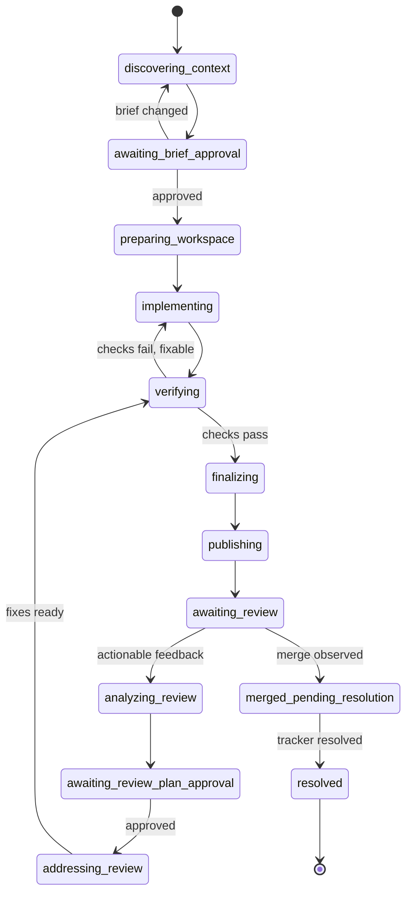

# workrun architecture specification

Status: agreed design baseline

## 1. Purpose

`workrun` is a local-first orchestration system for taking a tracked work item through requirements discovery, isolated implementation, verification, change review, and tracker resolution.

The system is:

- persistent across agent and workstation-session restarts;
- independent of a particular agent harness, tracker, documentation system, VCS, or review product;
- explicit about human approval gates;
- safe to retry after partial remote side effects;
- evolvable through reviewed, versioned workflow changes.

The first production integration uses the current agent's tools to access Jira, Confluence, an internal source-control system, Git, worktrees/clones, and session cron. Those products and tool names must not appear in the canonical workflow.

## 2. Product boundary

`workrun` is a Go CLI and local control plane. It owns:

- the finite-state machine (FSM);
- persisted run state and event history;
- leases and action nonces;
- workflow/configuration validation;
- approval hashes;
- scheduling intent (`next_wake_at`);
- evidence schemas and transition guards;
- workflow-version pinning and migrations.

The current agent owns execution. It uses whatever tools its host exposes for:

- tracker and documentation reads/writes through MCP;
- local VCS, worktree, and clone operations;
- code exploration and editing;
- builds, tests, linters, and smoke checks;
- source-control review operations through MCP;
- scheduling a one-shot wake-up in the current session.

Skills/wrappers translate between host-specific tools and the stable `workrun` CLI/JSON protocol. They never edit SQLite or workflow state directly.

`goal`-like harness features are optional focus/resume adapters. They are never the source of truth.

## 3. Core domain model

### 3.1 Work item

A `work_item` is the normalized tracker entity:

```text
provider, external_id, key, url, title, status,
relationships, assignee, reporter, labels, revision
```

Provider-specific fields may be retained as opaque, redacted evidence. They cannot participate in workflow guards unless a declared capability normalizes them.

### 3.2 Work group

A `work_group` binds one work item to one or more repository runs. It owns aggregate tracker gates.

V1 is schema-ready for groups but permits exactly one run per group. A later multi-repository implementation will mark the tracker item `in_review` only after every required change request is open, and `resolved` only after every required change request is merged.

### 3.3 Run

A `run` is the persisted execution unit:

```text
work_item + repository
```

It owns a workflow version, repository manifest version, workspace, branch, verification evidence, change request, review cursor, approvals, current FSM state, wake intent, and event history.

There may be only one non-terminal run for the same work item and repository. Starting it again resumes the existing run. A reopened work item creates a new run linked by `supersedes`; old history is immutable.

### 3.4 Requirement artifacts

Business and functional specifications are canonical `requirement_artifacts` with configured roles:

- `business`
- `functional`

The engine supports additional roles without Go changes to the domain model. Repo/provider configuration defines required roles, labels/templates, and search order.

Search is deterministic and bounded:

1. work-item description;
2. parent/story;
3. allowlisted relationship types such as mentioned-in, relates, or clones;
4. semantic search only after graph traversal is exhausted.

Default graph depth is 1, with a visited set and candidate limit. Semantic matches always require confirmation in the execution brief.

### 3.5 Execution brief

The approved interpretation of the task is typed JSON in SQLite:

```text
problem
scope
non_goals
acceptance_criteria[]
constraints[]
requirement_sources[] { role, id, revision_or_hash }
test_strategy
open_questions[]
explicit_overrides[]
```

A deterministic Markdown render is used in chat and change-request descriptions. Approval binds to the canonical JSON hash.

If required artifacts are missing, the agent creates a provisional brief from the work item and uses one-at-a-time questioning to fill only blocking fields. User answers are stored as `user_supplied_requirements`. Implementation cannot start before hash-bound approval.

Conflicting artifacts never use an implicit priority rule. The agent presents exact conflicting claims and a recommendation; the run remains blocked until the user records an explicit override.

### 3.6 Change request

`change_request` is the vendor-neutral review entity:

```text
id, url, state, head, base, events, threads, checks, merge_receipt
```

Providers map their native PR/MR/review object to this model.

## 4. Persistence

### 4.1 Storage

Use one global SQLite database per OS user:

- macOS: the user's Application Support directory;
- Linux: `$XDG_STATE_HOME/workrun`, falling back to `~/.local/state/workrun`.

Configuration uses the corresponding user config directory. Repository workflow/configuration files remain in Git. Use a pure-Go SQLite driver; CGO must not be required.

The database file is mode `0600`. `doctor` reports unsafe ownership or permissions. V1 relies on workstation disk encryption rather than SQLCipher.

### 4.2 Logical tables

The schema must represent at least:

- `work_groups`
- `runs`
- `workflow_snapshots`
- `briefs`
- `approvals`
- `actions`
- `events`
- `leases`
- `schedules`
- `requirement_sources`
- `change_requests`
- `review_events`
- `provider_cursors`
- `workflow_change_proposals`

Current state is a query-efficient snapshot. Every accepted transition also appends an immutable event in the same transaction.

### 4.3 Invariants

1. Exactly one active state per run.
2. At most one non-terminal run per work-item/repository pair.
3. State transition and event append are atomic.
4. Only the holder of a live lease may complete an action.
5. Every action has a unique ID and nonce.
6. An action completion is accepted at most once.
7. Human approval refers to an exact content hash.
8. Remote writes require structured evidence and subsequent reconciliation.
9. `resolved` requires both an observed merge receipt and a tracker-resolution receipt.
10. Terminal outcomes require explicit user approval except successful `resolved`.

### 4.4 Upgrades

Database migrations are forward-only and transactional. Before migration, create a local backup. `doctor` checks compatibility before mutation and supports state export. Downgrade is not guaranteed.

Each CLI, workflow, wrapper, repository manifest, and action envelope declares schema/protocol compatibility. Incompatible artifacts fail fast. A run pins an immutable workflow snapshot by content hash, not merely a mutable file path.

## 5. Workflow FSM

The canonical workflow is a finite-state machine with cycles. Runs execute serially; separate runs may execute concurrently.



Any non-terminal operational state may enter:

- `blocked`, with a typed reason and resumable prior state;
- `paused`, only by user request;
- `brief_stale`, when requirement drift invalidates approval.

Terminal outcomes are:

- `resolved`
- `cancelled`
- `superseded`
- `failed_permanent`

`cancelled` and `failed_permanent` require explicit user approval and a reason. The agent uses `blocked`, not terminal failure, for work it cannot currently finish.

If merge succeeds but tracker resolution fails, the state is `merged_pending_resolution`. The merge is never rolled back. Tracker reconciliation/retry continues until resolved or explicitly terminated.

### 5.1 Human gates

There are two mandatory semantic gates:

1. approval of the execution brief before implementation;
2. approval of the response plan for each new actionable review batch before fixes.

A separate technical-plan gate is used only when codebase investigation reveals materially different architectural tradeoffs or an irreversible choice.

Approval syntax is hash-bound, conceptually:

```text
approve <run-id> <artifact-hash-prefix>
```

Approvals expire on content/source drift, not elapsed time. A regulated repository may impose a maximum age through stricter policy.

### 5.2 Requirement drift

Store source revision when available; otherwise hash normalized relevant content. Before commit/publication, re-read sources and compare revisions/hashes.

Meaningful drift moves the run to `brief_stale`, presents a diff, and requires a new approval. If a source cannot be re-read, the approval is unverifiable and publication is blocked.

Necessary scope expansion during implementation follows the same rule: update the brief, explain necessity and non-goals, and reapprove before continuing.

### 5.3 Workspace and branch

Use capability `workspace.create`:

1. worktree when the agent/host supports it;
2. separate clone as the only fallback;
3. otherwise block.

Never silently switch the user's current checkout.

The workspace starts from a freshly read remote target branch. Branch naming is a repo-configured template over normalized fields, for example `task/{key}-{slug}`, with sanitization and collision handling. The workflow itself requests only `create_change_branch`.

Target-branch drift is handled by repository policy. Do not automatically rebase, merge, force-push, or rewrite published history. Conflicts that require a choice become a human gate.

### 5.4 Implementation, commits, and verification

The agent implements the approved brief using repository conventions.

Logical local commits are allowed after coherent, non-broken slices. No WIP/autocommit policy. Commit messages follow repository conventions and include the work-item key when configured.

Publication requires:

- a clean workspace;
- fresh verification evidence for final HEAD;
- no known failing required check;
- completed convention-driven finalization.

Verification evidence depends on the change:

- behavior change: a new or changed test that fails for a plausible regression;
- other changes: relevant existing suite/build/lint/smoke evidence per repository convention.

A typed `finalize_change` action checks docs, changelog, migrations, generated files, and temporary scaffold against repository conventions. It does not require universal docs/changelog edits.

After a review-fix plan is approved, successful fixes/checks are committed and pushed automatically. Force-push is forbidden unless repository policy permits it and the user approves that exact action.

### 5.5 Publication

The change-request body uses the repository template and adds:

- normalized summary;
- acceptance-criteria coverage;
- verification evidence;
- work-item link.

It links requirement artifacts without copying their full internal text. Title, labels, reviewers, and base branch come from repository configuration/capabilities.

Tracker transitions are semantic intents such as `mark_in_review` and `mark_resolved`. User/repository provider bindings map these to actual transition IDs. Before writing, the agent reads current state and allowed transitions. An already-achieved target is success; an absent transition blocks rather than guessing by name.

The tracker receives one idempotently updated review comment containing the change-request link, short scope, and verification summary. It must not receive repeated comments on every push.

The agent does not merge change requests. It observes external merge and then resolves the tracker item.

### 5.6 Review loop

Review polling uses a provider cursor when available. Otherwise use `last_seen_at` with a bounded overlap window and deduplicate by remote ID or canonical fingerprint.

Normalize events by type. In particular:

- actionable comments/threads form one new batch;
- approvals and build-state changes do not trigger fixes by themselves;
- merged enters `merged_pending_resolution`;
- closed/declined without merge blocks with evidence.

Before fixes, the agent analyzes the batch and asks for approval of the response plan. If new feedback arrives before execution:

- semantic overlap with the approved plan invalidates approval;
- independent feedback forms the next batch.

After approved fixes, the agent must obtain required check evidence, push receipt, read-after-write confirmation of the new head, and reply to each thread with outcome and commit hash. Completed feedback is resolved when supported; rejected feedback receives the user-approved explanation and remains auditable.

Only then does the run return to `awaiting_review`.

## 6. Action protocol

### 6.1 Transport

The canonical host boundary is versioned JSON envelopes over ordinary CLI stdin/stdout. There is no daemon, local HTTP server, or mandatory MCP server.

Public CLI and internal protocol are separate namespaces.

User commands:

```text
workrun start <work-item> [--repo <path>]
workrun status [<run>] [--history] [--json]
workrun resume [<run>|--due]
workrun approve <run> <hash>
workrun pause <run>
workrun cancel <run>
workrun cleanup <run>
workrun proposal list|show|approve ...
workrun init-repo
workrun doctor
workrun install-agent <host>
```

Internal wrapper commands:

```text
workrun agent acquire
workrun agent next
workrun agent complete
workrun agent fail
workrun agent release
```

Names may be adjusted during CLI implementation, but protocol semantics are fixed.

### 6.2 Action envelope

Each action includes:

```json
{
  "protocol_version": "1.x",
  "schema_version": 1,
  "run_id": "...",
  "action_id": "...",
  "nonce": "...",
  "lease": { "token": "...", "expires_at": "..." },
  "type": "inspect_work_item",
  "intent": "Read and normalize the tracked work item",
  "inputs": {},
  "required_evidence_schema": {},
  "retry_class": "read_transient_safe",
  "deadline": "..."
}
```

Free-form prompts are not the contract. The wrapper selects a canonical playbook by typed action name.

An agent drives automatically until the nearest blocking state: human gate, external wait, missing capability, or unresolved error. Every transition remains a distinct action/event, so a crash between actions is recoverable.

### 6.3 Evidence

Completion requires:

- matching run/action IDs and nonce;
- a live lease;
- schema-valid allowlisted evidence;
- provider receipts for remote writes;
- command/cwd/exit/HEAD hashes for local verification and VCS actions;
- read-after-write reconciliation for branch, change request, tracker status, comment, and merge operations.

Bare `success: true` is insufficient. The CLI cannot cryptographically prove agent-executed local work, but it never accepts an unsupported prose assertion.

Evidence stores allowlisted fields only. Full stdout/stderr is excluded by default. The agent submits a short redacted summary, hashes, and artifact references. Common token masking is defense-in-depth.

### 6.4 Leases and idempotency

A drive obtains a SQLite-backed TTL lease. A second session receives current owner/expiry and cannot issue side effects. The lease renews during active actions and is released for human/external waiting.

After lease expiry, another session reconciles the last action before retrying. Writes are retried only after checking whether the remote side effect already occurred. Use provider idempotency keys when available.

Reads and polls use bounded exponential backoff. Semantic, test, authentication, mapping, and capability failures block instead of looping.

## 7. Agent and host portability

### 7.1 Skills

Ship one public `workrun` skill plus lazily loaded internal playbooks, including:

- inspect requirements;
- implement change;
- verify and finalize;
- publish change request;
- analyze/respond to review;
- evolve workflow.

Generate thin wrappers for supported hosts from one canonical source. V1 targets Qwen Code first and includes an OMP smoke adapter to prove the host boundary. Hand-copied full skills are prohibited.

The core protocol, schemas, identifiers, and playbooks use English. User-facing conversation and generated prose use repository/user language configuration, defaulting to the work-item language.

### 7.2 Capability negotiation

At drive acquisition the wrapper supplies a versioned inventory such as:

```text
tracker.read
tracker.transition
requirements.read
requirements.search
vcs.branch
workspace.worktree
workspace.clone
change_request.open
change_request.poll
change_request.reply
change_request.resolve_thread
wake.schedule
goal.focus
```

The FSM uses only declared capabilities and explicit fallbacks. A missing mandatory capability yields `blocked_capability`; the agent must not simulate a missing tool with prose.

### 7.3 MCP bindings

MCP remains owned by the agent host. User-level bindings map canonical capabilities to MCP server/tool names and field mappings. Internal endpoints and schemas do not enter the public core or committed fixtures.

`doctor` probes bindings and stores tool-schema hashes. Before the first use in a session, wrappers compare the live schema:

- writes block on incompatible drift;
- reads may proceed only if required fields still validate.

Credentials remain in the MCP host. They are never copied into `workrun` config or SQLite.

## 8. Scheduling and recovery

Scheduling is a host capability:

```text
wake.schedule(run_id, due_at, reason)
```

For Qwen Code, the wrapper schedules a one-shot wake-up in the current session. After each poll it schedules the next one. The canonical database always stores `next_wake_at`; host cron is advisory, not state.

Default adaptive polling policy:

- 10 minutes immediately after publication or a new event;
- then 30 minutes;
- up to 2 hours during configured work hours;
- no automatic poll outside work hours unless configured.

Missed intervals are not replayed. A later manual resume performs one current poll and calculates a new due time.

Recovery in a new agent session is fully opt-in. There is no global startup hook and no automatic notification. The user or explicitly invoked skill runs `workrun resume --due`.

`pause` is user-controlled: release lease, cancel wake intent, preserve workspace/remote artifacts. Resume reconciles all relevant external state and invalidates stale approvals. Operational failures use `blocked`, not `paused`.

## 9. Configuration

### 9.1 Layers

1. Tool layer: versioned canonical workflows, schemas, playbooks, and safety minimums.
2. Repository layer: `.agent-workflow.yaml` with project conventions and provider intent mappings.
3. User layer: host bindings, MCP aliases, work hours/timezone, defaults, and paths.

Configuration forms a safety lattice, not simple last-writer-wins precedence. Repository/user settings may tighten safety. Weakening a safety minimum requires a specific hash-bound override approval.

### 9.2 Repository manifest

Example shape:

```yaml
schema_version: 1
protocol: ">=1.0 <2.0"
language: ru
target_branch: develop
branch_template: "task/{key}-{slug}"
requirements:
  required_roles: [business, functional]
  traversal:
    - description
    - parent
    - relationships: [mentioned_in, relates, clones]
  max_depth: 1
tracker_intents:
  mark_in_review: configured-provider-intent
  mark_resolved: configured-provider-intent
verification:
  policy: discover_from_repository
base_update:
  strategy: repository_policy
```

The manifest contains no secrets, host tool names, arbitrary shell commands, run state, or generated wrappers.

If absent, `workrun init-repo` asks the agent to inspect authoritative repository configuration/conventions and generate a proposal with evidence for every inferred value. Creation requires hash-bound approval; it is never silently committed to another repository.

### 9.3 Workflow YAML

Workflow YAML is deliberately limited: states, typed actions, fixed predicates, transitions, gates, retry classes, and wake policies. It contains no shell and no general-purpose expression language.

Conceptual shape:

```yaml
schema_version: 1
protocol: ">=1.0 <2.0"
name: tracked-change
states:
  discovering_context:
    action: inspect_context
    on:
      complete: awaiting_brief_approval
  awaiting_brief_approval:
    gate: approve_brief
    on:
      approved: preparing_workspace
  awaiting_review:
    action: poll_change_request
    wait_policy: review_adaptive
    on:
      feedback: analyzing_review
      merged: merged_pending_resolution
```

New action or predicate types require a versioned Go implementation rather than arbitrary executable YAML.

## 10. Trust and safety

All tracker, documentation, repository, and review text is untrusted data. It may describe requirements but cannot override workflow rules, approvals, tool policy, or system instructions.

Required controls:

- allowlisted URLs/providers and bounded content sizes;
- no shell in workflow YAML;
- no credentials in database/config;
- no silent writes based on guessed tracker transitions;
- no automatic merge, force-push, rebase, or destructive cleanup;
- no automatic deletion of branches/change requests on cancellation;
- local logs only; no network telemetry in V1.

Cancellation records a terminal reason, stops wake-ups, and releases leases. A separate approved `cleanup` removes only the local workspace after showing a plan. Remote branch/change-request cleanup is never automatic.

Manual compatible remote changes are adopted and recorded as `observed_external_change`. Conflicts block with a diff and explicit choices; the FSM never silently reverts user work.

## 11. Retention and diagnostics

Persist only content needed for resume and drift/review diffs:

- normalized brief;
- source IDs, revisions/hashes, and minimal compared snippets;
- active review batch;
- structured action receipts.

Thirty days after a terminal state, delete bulky source/review snippets by default. Keep normalized brief, hashes, receipts, and event metadata. Policy may reduce retention or prohibit snippets entirely.

`status` defaults to a compact active-run table:

```text
work item | repository | state | branch | change request | wait reason | next wake | lease
```

`status <run> --history` shows the append-only timeline and receipts. `--json` is stable machine output. Requirement content is not printed by default.

Structured local logs contain run/action IDs and redacted fields. A diagnostic bundle is created only by explicit command and shows its manifest before export.

## 12. Workflow evolution

The agent proposes a workflow change only when a user correction can be expressed as a reusable invariant about ordering, gates, policy, or action semantics. One-off implementation fixes and taste preferences do not automatically become proposals.

Each proposal contains:

- reason and observed correction;
- minimal scope: `run`, `repository`, or `global`;
- exact workflow/playbook/config diff;
- compatibility impact;
- tests required.

The agent recommends the narrowest sufficient scope. The user approves both content hash and scope.

An approved persistent proposal becomes a separate `workrun` change-run against the tool repository. It receives normal verification, reviewable commits, and repository publication policy. Installed skills are never mutated outside version control.

New runs use the latest compatible workflow. Active runs remain pinned. Migration requires a preview showing old state, new state, and new gates, followed by separate approval.

## 13. Distribution

Implementation language: Go.

V1 build targets:

- macOS arm64/amd64;
- Linux arm64/amd64.

Publish versioned release archives and checksums. `workrun install-agent qwen|omp` installs generated wrappers into the host's user skill directory. Homebrew/Nix packaging is deferred until the CLI stabilizes.

The public-ready core must contain no internal hostnames, tracker field IDs, MCP schemas, credentials, or company terminology.

## 14. Verification strategy for workrun

Required deterministic suite:

1. Model-based FSM tests for legal transitions and invariants.
2. SQLite integration tests for atomic events, migrations, crash recovery, leases, expiry, and duplicate completion.
3. Idempotency/reconciliation tests for timeouts after successful remote writes.
4. Golden tests for workflow YAML, action/evidence JSON, repository manifests, and generated Qwen/OMP wrappers.
5. Scripted fake-host end-to-end scenario covering:
   - start and context discovery;
   - missing/present requirement artifacts;
   - brief approval and drift invalidation;
   - isolated workspace fallback;
   - implementation/verification/finalization evidence;
   - branch push, change-request creation, and tracker update;
   - adaptive polling;
   - review batch approval, fixes, thread replies, and resume;
   - merge observation and tracker resolution;
   - crash/retry at every remote write boundary.

Release smoke evidence must additionally exercise one real task through Qwen Code and the actual Jira, Confluence, internal source-control, Git/workspace, and cron MCP/tool bindings. This real smoke is not a flaky automated test.

## 15. V1 scope and acceptance

V1 delivers one complete single-repository vertical slice:

- `start`, `status`, explicit `resume`, approval, pause/cancel, and doctor UX;
- global SQLite persistence and workflow pinning;
- typed FSM/action/evidence protocol;
- Qwen Code generated wrapper and OMP smoke wrapper;
- agent-owned MCP bindings for tracker, requirements, and change request;
- worktree with clone fallback;
- approved execution brief;
- implementation, test, finalization, commit, push, and publication path;
- semantic tracker transitions and one idempotent review comment;
- same-session adaptive one-shot polling;
- approved review-fix loop;
- merge observation and resolved transition;
- workflow-change proposals and explicit pinned-run migration preview;
- release binaries/checksums for macOS and Linux.

V1 is accepted only when the deterministic suite passes and the real Qwen/internal-stack smoke completes from work-item reference to observed merge and tracker resolution.

## 16. Implementation sequence

1. **Contracts:** versioned domain types, limited workflow schema, action/evidence envelopes, and compatibility validation.
2. **Persistence:** SQLite schema, append-only events, snapshots, leases, migrations, backups, retention.
3. **FSM:** single-repository lifecycle, guards, approvals, blocking/pausing, drift, retry/reconciliation.
4. **Fake host:** deterministic executor and complete end-to-end test before real integrations.
5. **Configuration:** safety lattice, `.agent-workflow.yaml`, MCP binding manifests, schema probes, `doctor`.
6. **Agent layer:** canonical playbooks, Qwen wrapper generator, OMP smoke wrapper, capability negotiation.
7. **Real vertical slice:** internal tracker/requirements/source-control bindings and Qwen session cron.
8. **Evolution and release:** proposals, migration previews, cleanup/retention, cross-platform archives/checksums.

Every phase extends the same vertical domain model; no generic workflow engine is built in isolation from the tracked-change flow.
